# ELK-SIEM-Project
Design and Implementation of a Centralized Log Monitoring and Threat Detection using ELK Stack (SIEM Project)

---

# Cyber Security: Major Project
## Design and Implementation of a Centralized Log Monitoring and Threat Detection System using ELK Stack

---

## 1. Introduction

In modern enterprise environments, systems generate massive amounts of logs that contain critical security information. Monitoring these logs in a decentralized manner makes it difficult to detect security incidents, unauthorized access, and malicious activities.

This project focuses on designing and implementing a centralized log management and monitoring system using the ELK Stack (Elasticsearch, Logstash, and Kibana). Logs from multiple endpoints, including Windows and Linux systems, are collected using Beats agents and analyzed in real time to detect suspicious activities.

The project simulates a real-world Security Operations Center (SOC) environment and provides hands-on experience with SIEM tools widely used in the cybersecurity industry.

---

## 2. Objectives

The primary objectives of this project are:

- Understand the concept of centralized logging and SIEM
- Deploy and configure the ELK Stack
- Collect logs from Windows and Linux endpoints using Beats
- Analyze and query logs for security monitoring
- Create dashboards and alerts for threat detection
- Gain practical exposure to SOC analyst workflows

---

## 3. System Requirements

### Host Machine
- Minimum 16 GB RAM
- Intel/AMD processor with virtualization enabled
- Virtualization software (VirtualBox / VMware)

---

## Virtual Machine Setup

| VM | Operating System | RAM | Purpose |
|----|------------------|-----|---------|
| VM1 | Ubuntu Server | 4 GB | ELK Server |
| VM2 | Windows 7/10 | 4 GB | Windows Endpoint |
| VM3 | Ubuntu / Kali Linux | 2 GB | Linux Endpoint / Attacker |

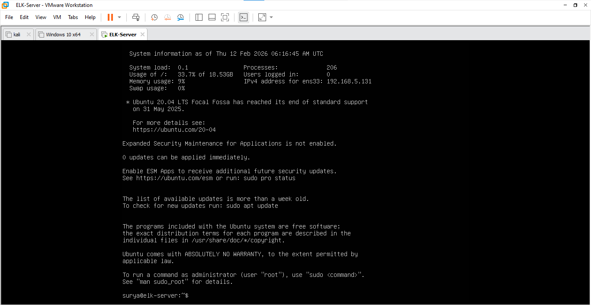
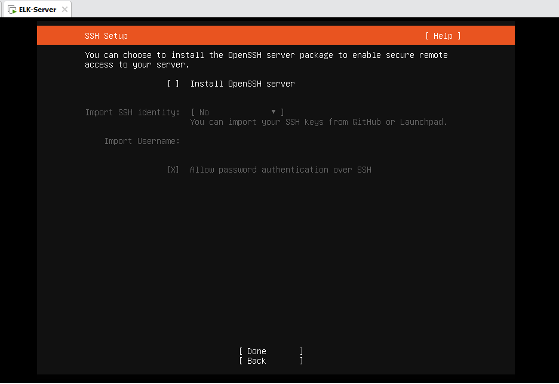

---

## 4. Project Architecture

- Ubuntu Server hosts the ELK Stack
- Winlogbeat is installed on Windows machine to collect Windows Event Logs
- Filebeat is installed on Linux machine to collect system and authentication logs
- Logs are securely forwarded to the ELK Server
- Kibana is used for visualization, querying, and alerting

---

## 5. Project Description and Implementation

### Phase 1: ELK Stack Installation and Configuration

**1. Install Dependencies**
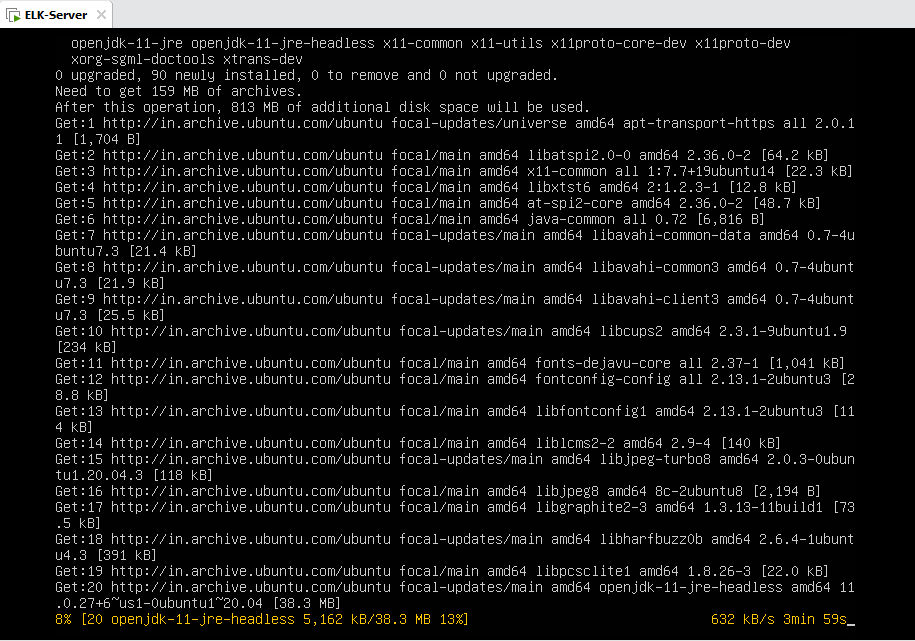

**2. Install Elasticsearch on Ubuntu and configure indices**
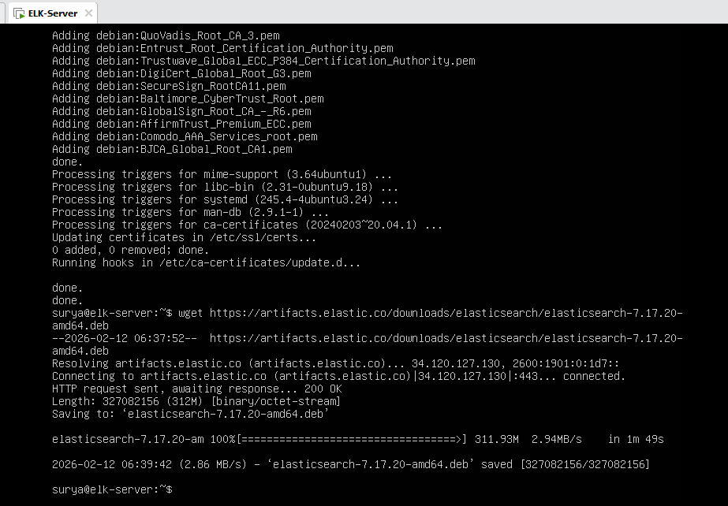
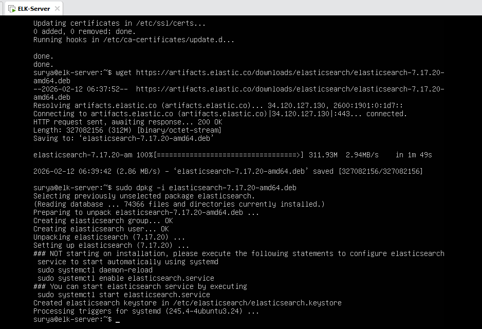

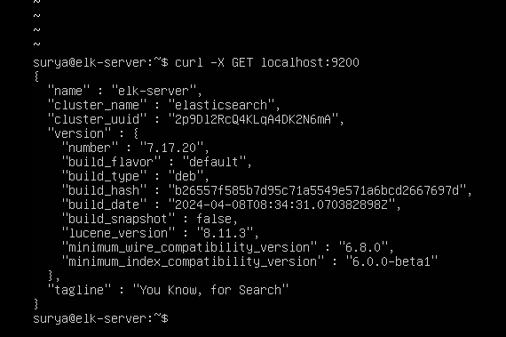

**3. Install Logstash for log processing and parsing**

**4. Install Kibana for visualization and querying**

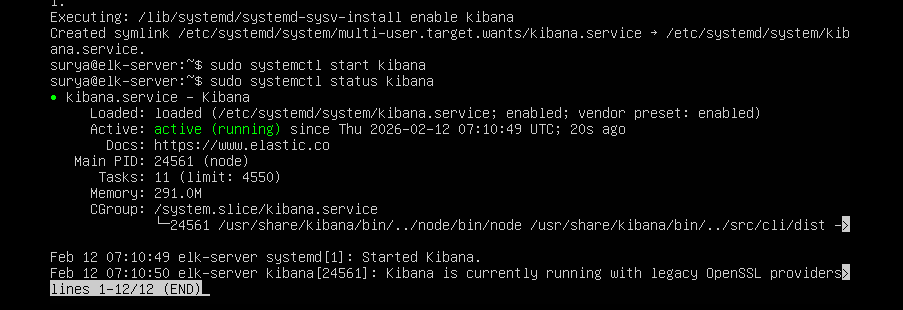

**5. Verify ELK functionality using test logs**

---

### Phase 2: Endpoint Log Collection

#### Windows Endpoint
- Install and configure Winlogbeat
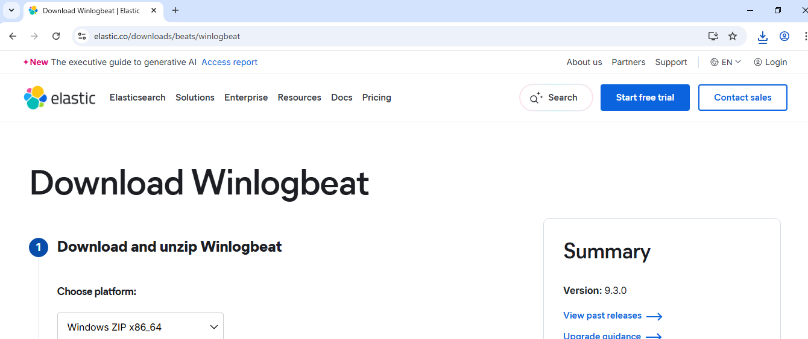

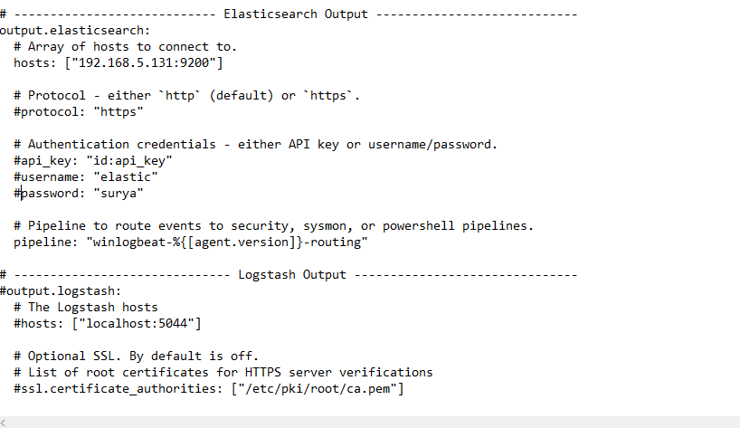
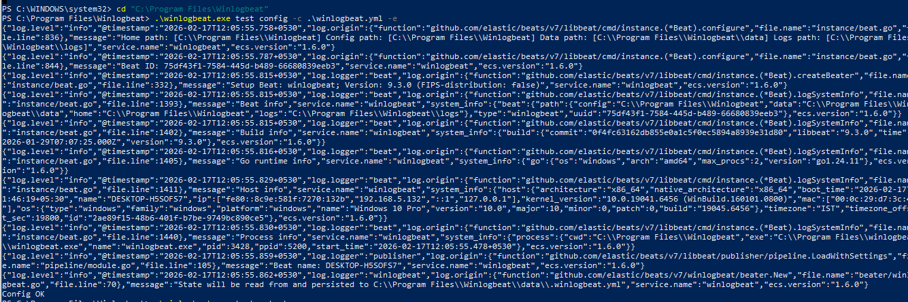
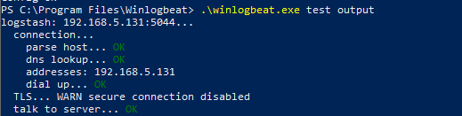

- Collect Security, System, and Application logs and forward to ELK server
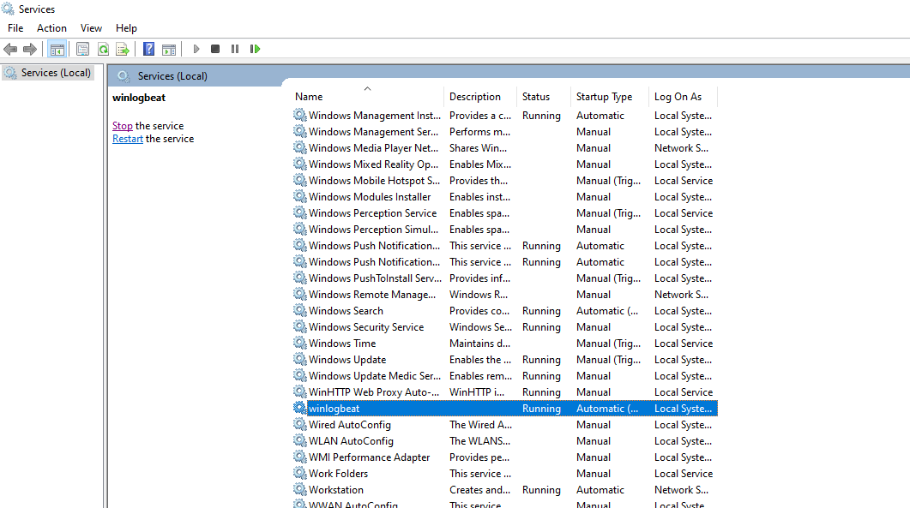

#### Linux Endpoint
- Install and configure Filebeat
- Collect Authentication logs (`auth.log`) and System logs (`syslog`) and forward them to the ELK server.

---

### Phase 3: Log Flow Analysis

Students will observe log flow from endpoints to ELK and perform log searches using KQL (Kibana Query Language).

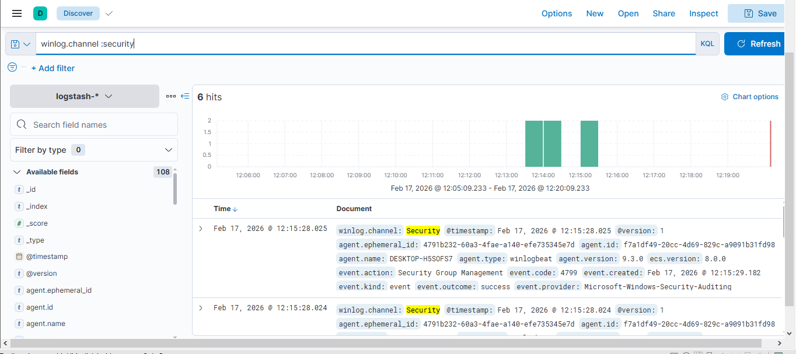
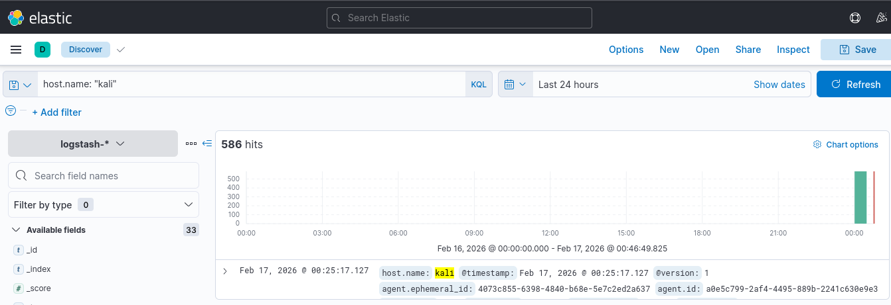

---

## 6. Security Use-Cases Implementation

### Use-Case 1: Windows Failed Login Detection
- Monitor multiple failed login attempts
- Identify potential brute-force attacks
- Analyze Event ID 4625
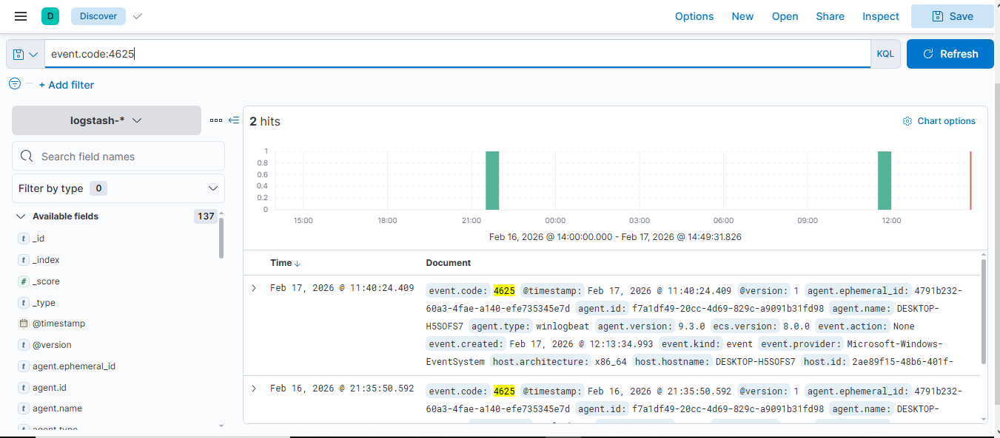

### Use-Case 2: Suspicious Successful Login
- Detect successful logins following multiple failures
- Identify possible compromised accounts
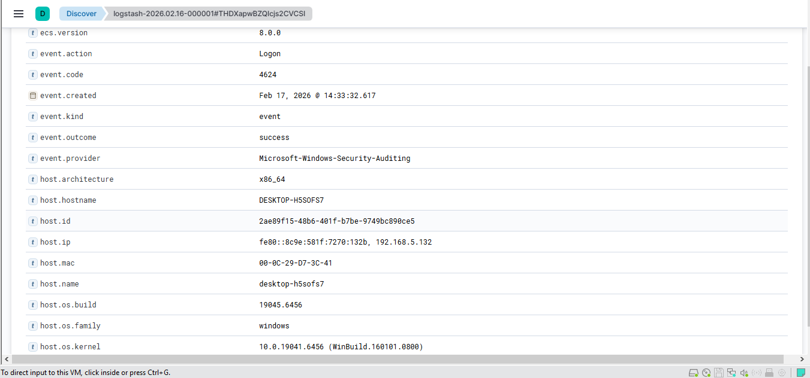

### Use-Case 3: Linux SSH Login Monitoring
- Monitor SSH login attempts
- Detect unauthorized access
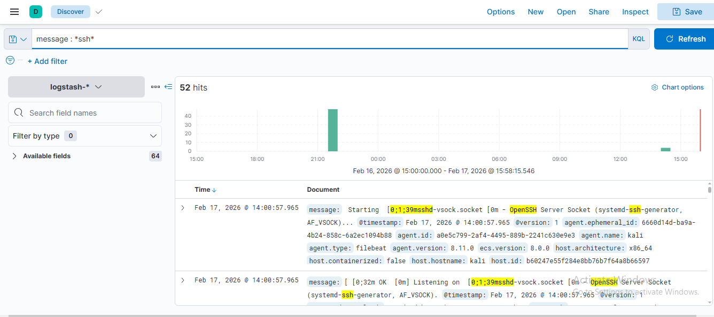
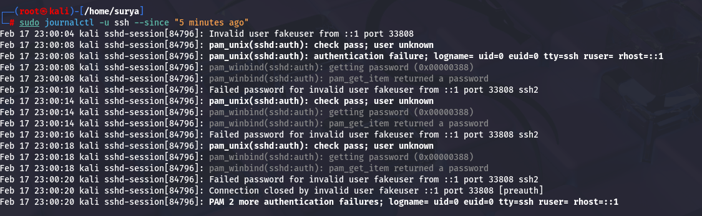

### Use-Case 4: File Integrity Monitoring
- Track changes to sensitive files on Linux systems
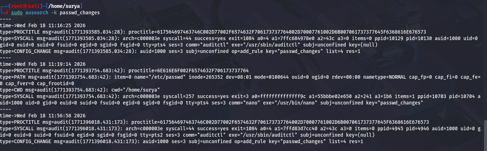

### Use-Case 5: Malicious Activity Simulation (Optional)
- Execute suspicious commands from Kali Linux
- Analyze logs generated due to abnormal behavior
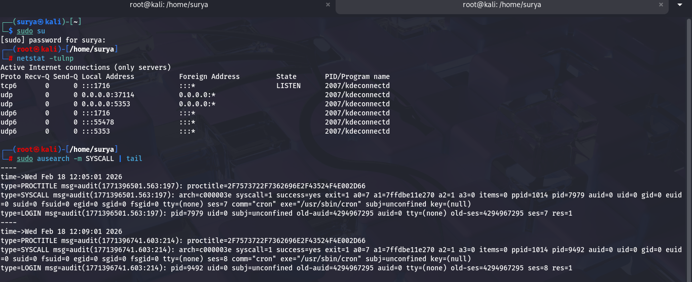

---

## 7. Dashboards and Alerts

Created Kibana dashboards displaying:

- **Login attempts**
  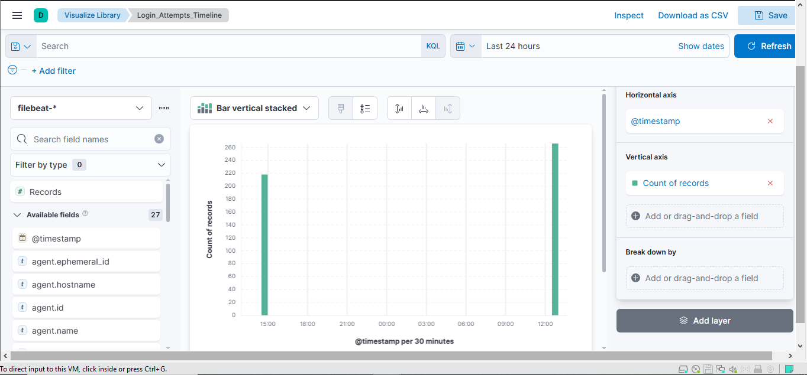
- **Error events**
  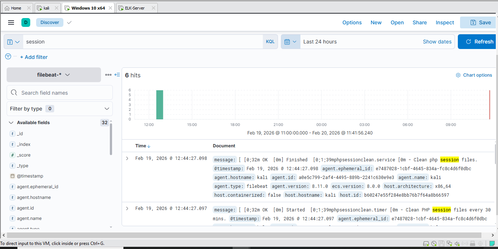
- **Top source IP addresses**
  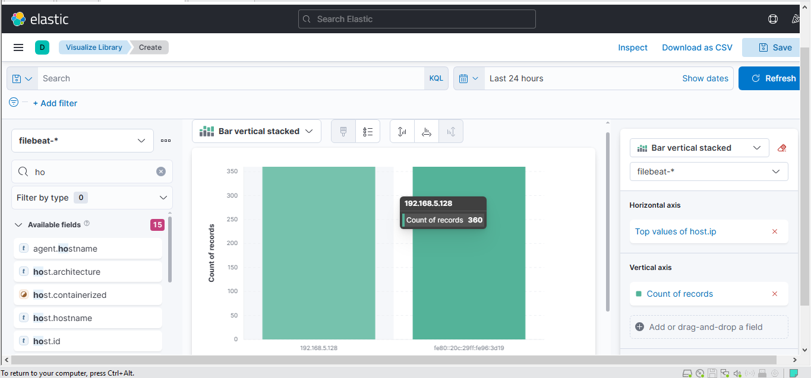

Configured alerts for:

- **Multiple failed login attempts**
  
- **Unauthorized access patterns**
  
- **Abnormal system activity**
  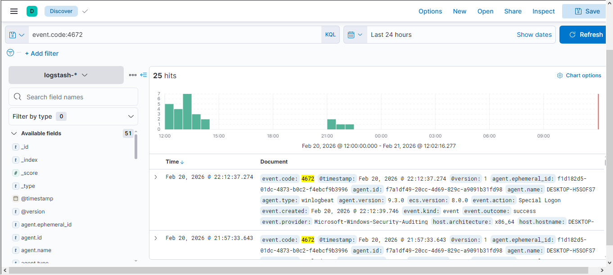

---

## 8. Results and Observations

- Centralized log visibility achieved
- Real-time monitoring of multiple systems
- Effective detection of suspicious activities
- Improved understanding of SIEM and SOC operations

### Documentation Note

Detection rules for suspicious activities were successfully configured in Elastic Security. Due to resource limitations and time synchronization differences in the lab environment, automatic alert signals were not generated in the SIEM signals index.

However, the configured detection rules were validated by manually analyzing corresponding security events in Kibana Discover. Event IDs 4625 (Failed Login), 4624 (Successful Login), and 4672 (Special Privilege Assignment) were observed, confirming detection of failed authentication attempts, login behavior patterns, and abnormal privileged activities.

This validates that the alert logic and log ingestion pipeline were functioning correctly despite alerts not appearing automatically.

---

## 9. Learning Outcomes

After completing this project:

- Understanding SIEM architecture
- Hands-on ELK Stack experience
- SOC analyst workflow exposure
- Log analysis and threat detection skills
- Understanding real-world cybersecurity monitoring workflows
